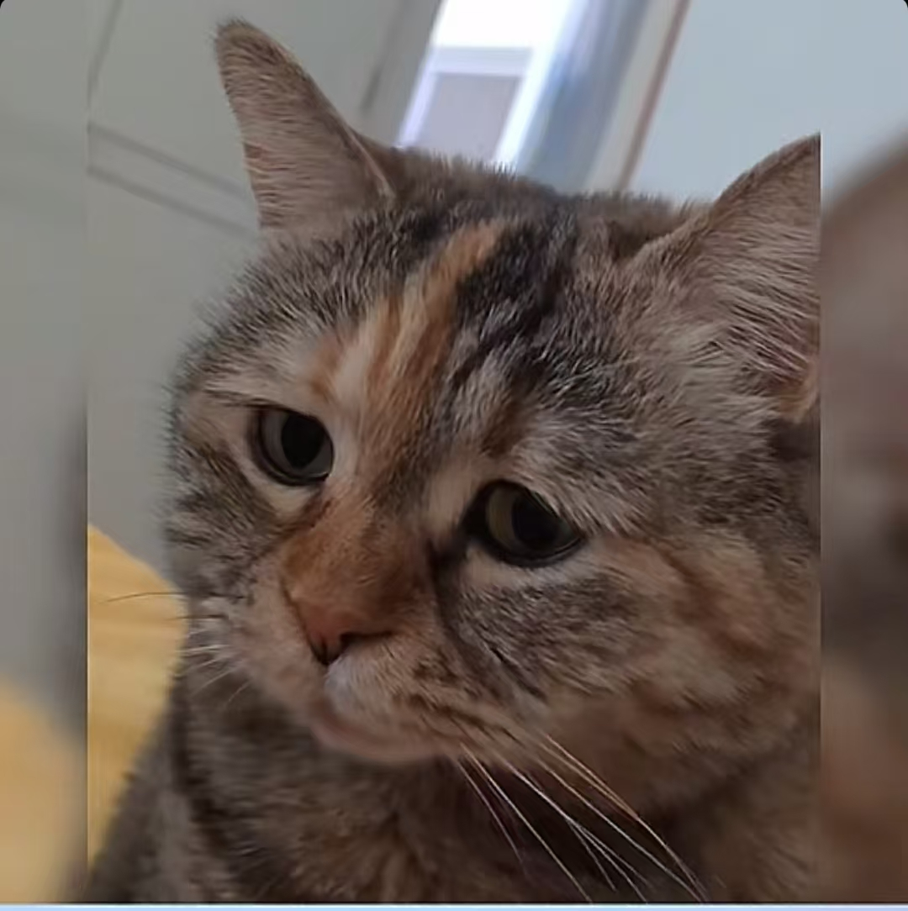

# 震惊猫meme的自我介绍 <!-- 一级标题 -->


大家好，我是**震惊猫meme**，我的身份是*猫meme剧场代表*。以下是我的自我介绍：

---

##  🗃️基础档案 <!-- 二级标题 -->
###  🧥外貌特征 <!-- 三级标题 -->
- 银灰毛发 + 黑色斑纹
- 震惊眼神的溜圆大眼
- 牙齿微露，胡须修长
- ~~体型微硕~~

### 🧑‍🤝‍🧑我的好朋友 <!-- 二级标题 -->
1. 委屈猫meme


2. 希特猫meme


3. <del>打人猫meme</del>


###  📍重要坐标 <!-- 三级标题 -->
- 🏠**居住地**: 常在[抖音app](https://www.douyin.com/)
- 🏪**工作地**: 也在[抖音app](https://baike.baidu.com/item/%E6%8A%96%E9%9F%B3/20784697)
- 🔎**其它出没地**: [B站](https://baike.baidu.com/item/%E5%93%94%E5%93%A9%E5%93%94%E5%93%A9/8018053)

---

### ⏰日常作息表 <!-- 三级标题 -->

| 时间       | 事项                                            |
|----------|-----------------------------------------------|
| 0:00 AM  | <center>在视频中给夜猫子们取乐</center>                  |
| 12:00 AM | <center>可能成为下饭素材</center>                     |
| 21:00 PM | <center>在短视频中拖延各位看官洗漱休息</center>              |
### 💬人生信条 <!-- 二级标题 -->
> "震惊到无语，一切尽在不言中。" 

---

## 我的专业是人工智能 <!-- 二级标题 -->
### 我最喜欢的一段代码 <!-- 二级标题 -->
```python
import numpy as np
print(np.array([1, 2, 3]) ** 2)
```
其中执行`print(np.array([1, 2, 3]) ** 2)`可输出结果。

### 我最喜欢的环境管理工具是conda


### 我可以在IDE上使用我建立的虚拟环境
